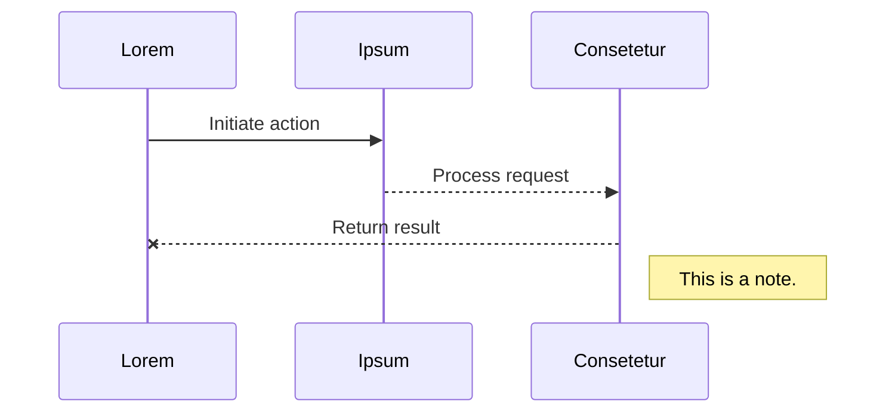
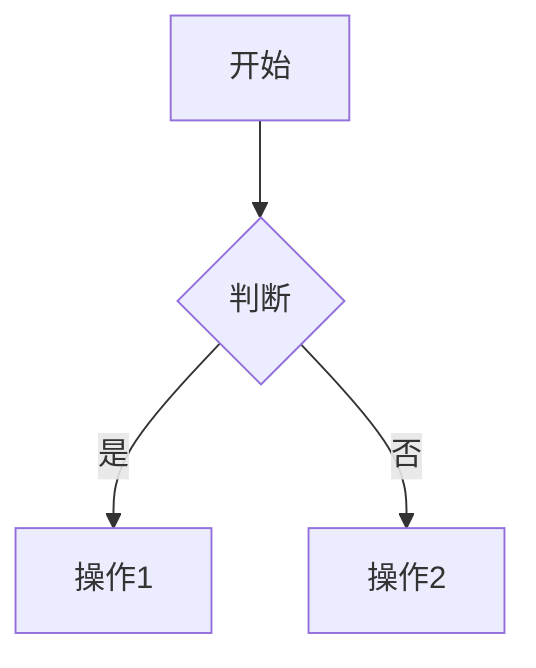
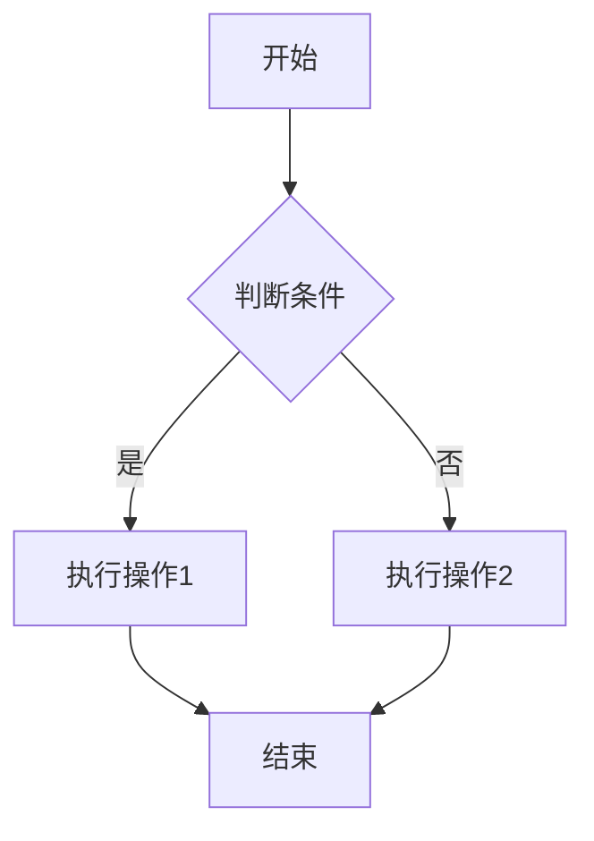
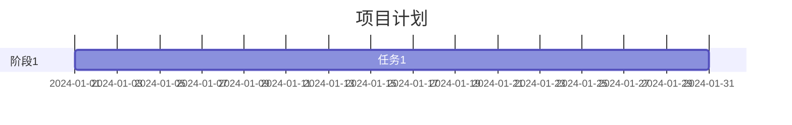
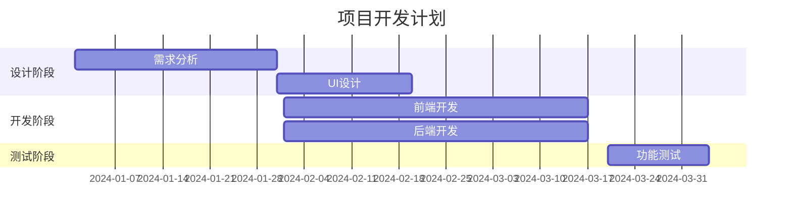
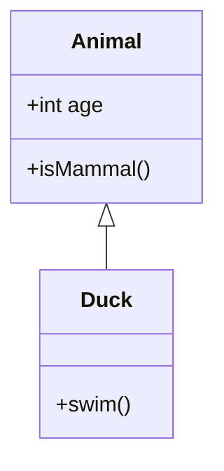
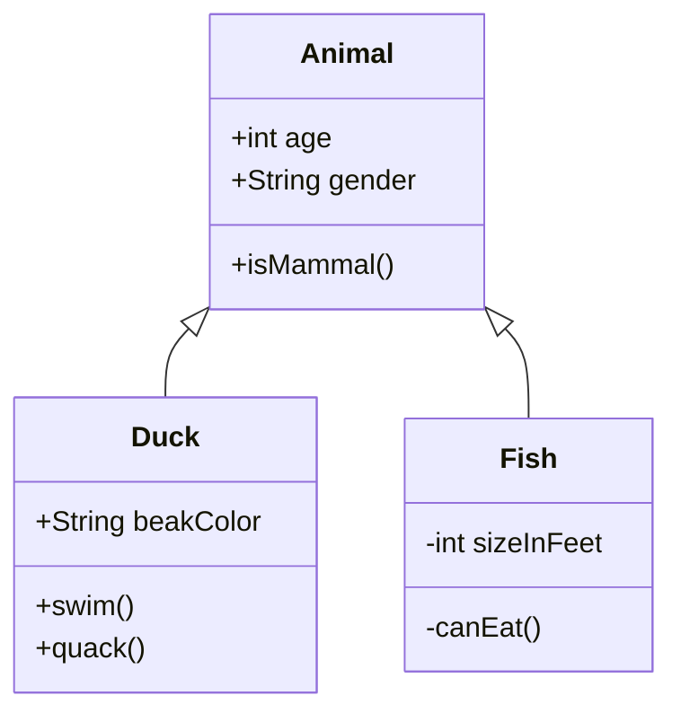

# **Markdown文本样式测试文档**

------

<Toc />

在markdown里强制换行是在末尾添加2个空格+1个回车.  
在markdown里可以使用 \ 对特殊符号进行转义.  

# 1. 标题

**语法**

```
# This is an <h1> tag
## This is an <h2> tag
### This is an <h3> tag
#### This is an <h4> tag
```

**实例**

# This is an h1 tag
## This is an h2 tag
### This is an h3 tag
#### This is an h4 tag
##### This is an h5 tag
###### This is an h6 tag
this is a p tag

# 2. 强调和斜体

**语法**
```TExt
*This text will be italic*
_This will also be italic_

**This text will be bold**
__This will also be bold__
```
**实例**

*This text will be italic*
_This will also be italic_

**This text will be bold**
__This will also be bold__

# 3. 有序列表和无序列表

**语法**

```
* Item 1
* Item 2
* Item 3

1. Item 1
2. Item 2
3. Item 3
```

**实例**
* Item 1
* Item 2
* Item 3

1. Item 1
2. Item 2
3. Item 3

# 4. 图片

**语法**

```

```

**实例**

这张照片你可能需要学会一种叫VPN的魔法才能看到：


# 5. 超链接

**语法**

```
[link-name](link-url)
```

**实例**

[DD's Blog](http://www.DDsummer.asia)

# 6. 引用

**语法**
```
>引用 引用名人名言、参考文献
>在我的博客里面一边用作重点标注和知识拓展
```

**实例**

> For your beauty, I am waiting...  
> 为你的美丽，爱慕未停…… 

# 7. 单行代码

**语法**
```
`This is an inline code.`
```

**实例**

`单行代码, 我的博客一般用来显示特殊名词、术语`

# 8. 多行代码

**语法**

`````
````javascript
for (var i=0; i<100; i++) {
    console.log("hello world" + i);
}
````
`````

**实例**

```js
for (var i=0; i<100; i++) {
    console.log("hello world" + i);
}
```

也可以通过缩进来显示代码, 下面是示例:  

    console.log("Hello_World");

# 9.表格

**语法**

```markdown
| 这是一个表格头部 | 这是一个表格头部 | 这是一个表格头部 | 这是一个表格头部 | 这是一个表格头部 |
| :--------------: | :--------------: | :--------------: | :--------------: | :--------------:|
|  这是一个单元格  |  这是一个单元格  |  这是一个单元格  |  这是一个单元格  |  这是一个单元格  |
|  这是一个单元格  |  这是一个单元格  |  这是一个单元格  |  这是一个单元格  |  这是一个单元格  |
|  这是一个单元格  |  这是一个单元格  |  这是一个单元格  |  这是一个单元格  |  这是一个单元格  |
```

一般来说没人会这么创建表格叭，一般都是直接插入的勒

**实例**

| 这是一个表格头部 | 这是一个表格头部 | 这是一个表格头部 | 这是一个表格头部 | 这是一个表格头部 |
| :--------------: | :--------------: | :--------------: | :--------------: | :--------------: |
|  这是一个单元格  |  这是一个单元格  |  这是一个单元格  |  这是一个单元格  |  这是一个单元格  |
|  这是一个单元格  |  这是一个单元格  |  这是一个单元格  |  这是一个单元格  |  这是一个单元格  |
|  这是一个单元格  |  这是一个单元格  |  这是一个单元格  |  这是一个单元格  |  这是一个单元格  |

# 10.数学公式

这个严格来说也不是markdown的语法，你应该去学习 **LaTeX 与数学表达式语法**

如果我做了教程会在下方出现一个链接！

**语法**

```latex
$$
\begin{pmatrix}
a & b\\
c & d
\end{pmatrix}
$$
```

**实例**

$$
\begin{pmatrix}
a & b\\
c & d
\end{pmatrix},
\begin{bmatrix}
a & b\\
c & d
\end{bmatrix},
\begin{vmatrix}
a & b\\
c & d
\end{vmatrix}
$$

# 11.mermaid图像

这个不属于markdown 的语法，这只是在代码块里使用了mermaid语法制作示意图



# 12.任务列表

**语法**

```markdown
- [x] 这是已经完成的任务1
- [ ] 这是任务2
- [ ] 这是任务3
```

**实例**

- [x] 这是已经完成的任务1
- [ ] 这是任务2
- [ ] 这是任务3

# 13.脚注

**语法**

```
这是一个脚注示例[^1]
[^1]: 这是脚注的内容
```

**实例**

这是一个脚注示例[^1]

[^1]: 这是脚注的内容

# 14.高亮

**语法**

```
==This will be highlighted==
```

**实例**

==This will be highlighted!==

# 15.目录

**说明**

`[TOC]` 是部分 Markdown 编辑器（如 Typora）支持的目录语法，VitePress 原生不支持。

本站使用自定义 `<Toc />` 组件实现内联目录，见文章开头。也可以使用右侧大纲栏导航。

# 16.下划线

**语法**

```
------ 6根短线
```

**实例**

------

# 17.上标下标

**语法**

```
2^2^
C~2~
C^2^~2~
要表示排列组合数请使用latex公式
```

**实例**

2^2^

C~2~

C^2^~2~

# 18.内联公式

**语法**

```
$E = mc^2$
```

**实例**

$E = mc^2$

# 19.参考链接

**语法**

```
直接粘贴自动识别
```

**实例**

https://guides.github.com/features/mastering-markdown/ 
https://help.github.com/articles/basic-writing-and-formatting-syntax/

# 20.删除线

**语法**

```
~~This text will be deleted~~
```

**实例**

~~This text will be deleted~~

# 21.键盘按键

**语法**

```
<kbd>Ctrl</kbd> + <kbd>C</kbd>
```

**实例**

按 <kbd>Ctrl</kbd> + <kbd>C</kbd> 复制文本

按 <kbd>Ctrl</kbd> + <kbd>V</kbd> 粘贴文本

按 <kbd>Ctrl</kbd> + <kbd>Shift</kbd> + <kbd>Esc</kbd> 打开任务管理器

# 22.变量标记

**语法**

```
<var>variable_name</var>
```

**实例**

函数的返回值是 <var>result</var>，输入参数为 <var>x</var> 和 <var>y</var>

# 23.缩写

**语法**

```
<abbr title="HyperText Markup Language">HTML</abbr>
```

**实例**

<abbr title="HyperText Markup Language">HTML</abbr> 是网页的标准标记语言

<abbr title="Cascading Style Sheets">CSS</abbr> 用于样式设计

<abbr title="JavaScript">JS</abbr> 是网页的编程语言

# 24.引用嵌套

**语法**

```
> 第一层引用
>> 第二层引用
>>> 第三层引用
```

**实例**

> 第一层引用
>> 第二层引用
>>> 第三层引用

# 25.混合列表

**语法**

```
1. 有序列表项 1
   - 无序子项 1
   - 无序子项 2
2. 有序列表项 2
   1. 有序子项 1
   2. 有序子项 2
```

**实例**

1. 有序列表项 1
   - 无序子项 1
   - 无序子项 2
2. 有序列表项 2
   1. 有序子项 1
   2. 有序子项 2

# 26.定义列表

**语法**

```markdown
术语 1
: 定义 1

术语 2
: 定义 2a
: 定义 2b
```

**实例**

HTML
: 超文本标记语言，用于创建网页结构

CSS
: 层叠样式表，用于网页样式设计
: 可以控制颜色、布局、字体等

# 27.表情符号

**语法**

```
:smile: :heart: :thumbsup: :rocket:
```

**实例**

:smile: :heart: :thumbsup: :rocket: :fire: :star: :sparkles:

# 28.HTML 标签

**语法**

```html
<div style="color: red;">红色文字</div>

<details>
<summary>点击展开</summary>
内容
</details>
```

**实例**

<div style="color: red; font-weight: bold;">这是红色加粗文字</div>

<details>
<summary>点击展开更多内容</summary>

这是隐藏的内容，点击上方可以展开或收起。

可以包含任何 Markdown 内容：

- 列表项 1
- 列表项 2

</details>

# 29.水平分割线

**语法**

```
---
***
___
```

**实例**

使用三个短横线：

---

使用三个星号：

***

使用三个下划线：

___

# 30.转义字符

**语法**

```
\* 星号
\_ 下划线
\# 井号
\[ 方括号
\] 方括号
\( 圆括号
\) 圆括号
```

**实例**

\* 这不是斜体 \*

\# 这不是标题

\[这不是链接\]

# 31.代码块语言高亮

**语法**

````markdown
```javascript
// 代码
```

```python
# 代码
```
````

**支持的常见语言**

```javascript
// JavaScript
console.log('Hello World');
```

```python
# Python
print("Hello World")
```

```java
// Java
System.out.println("Hello World");
```

```css
/* CSS */
body {
  background: #fff;
}
```

```bash
# Bash
echo "Hello World"
```

```json
{
  "name": "example",
  "version": "1.0.0"
}
```

```typescript
// TypeScript
const greeting: string = "Hello World";
console.log(greeting);
```

```sql
-- SQL
SELECT * FROM users WHERE id = 1;
```

# 32.引用块中的其他元素

**语法**

```markdown
> ### 标题
> 
> 段落文字
> 
> - 列表
> 
> ```code```
```

**实例**

> ### 引用中的标题
> 
> 这是引用块中的段落文字。
> 
> - 引用中的列表项 1
> - 引用中的列表项 2
> 
> ```javascript
> // 引用中的代码块
> console.log('Hello');
> ```
> 
> **引用中的加粗文字** 和 *斜体文字*

# 33.复杂表格

**语法**

```markdown
| 左对齐 | 居中对齐 | 右对齐 |
| :--- | :---: | ---: |
| 内容 | 内容 | 内容 |
```

**实例**

| 左对齐 | 居中对齐 | 右对齐 |
| :--- | :---: | ---: |
| 单元格 | 单元格 | 单元格 |
| 单元格 | 单元格 | 单元格 |

| 功能 | 支持 | 备注 |
| --- | --- | --- |
| 加粗 | ✅ | 使用 `**text**` |
| 斜体 | ✅ | 使用 `*text*` |
| 代码 | ✅ | 使用 `` `code` `` |
| 链接 | ✅ | 使用 `[text](url)` |

# 34.注释

**语法**

```
<!-- 这是一个注释，不会在页面中显示 -->
```

**实例**

<!-- 这是一个注释，你在页面上看不到我 -->

上面有一行注释，但你看不到它。

# 35.多行公式块

**语法**

```latex
$$
\begin{aligned}
f(x) &= x^2 \\
&= x \cdot x
\end{aligned}
$$
```

**实例**

$$
\begin{aligned}
f(x) &= x^2 + 2x + 1 \\
&= (x + 1)^2
\end{aligned}
$$

$$
\sum_{i=1}^{n} i = \frac{n(n+1)}{2}
$$

$$
\int_{0}^{\infty} e^{-x^2} dx = \frac{\sqrt{\pi}}{2}
$$

# 36.流程图 (Mermaid)

**语法**

````markdown

````

**实例**



# 37.甘特图 (Mermaid)

**语法**

````markdown

````

**实例**



# 38.类图 (Mermaid)

**语法**

````markdown

````

**实例**



---

## 参考资源

- [GitHub Markdown 指南](https://guides.github.com/features/mastering-markdown/)
- [Markdown 基础语法](https://help.github.com/articles/basic-writing-and-formatting-syntax/)
- [Mermaid 官方文档](https://mermaid.js.org/)
- [LaTeX 数学公式](https://katex.org/docs/supported.html)
